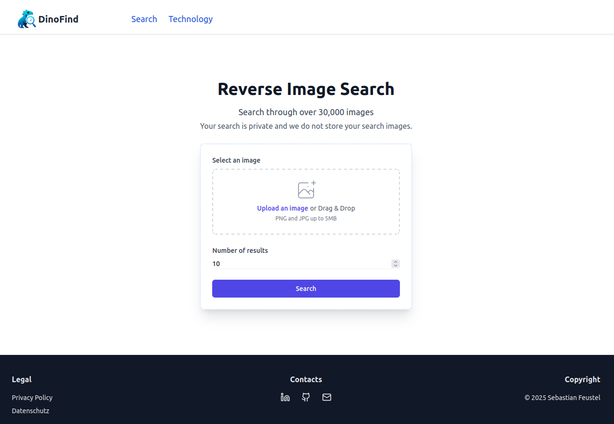

    <h1> 🦕 Dinofind2 </h1>
    
⚡ A website that allows users to search for images based on images. 🔍

    
    
    

    

This project is a minimal search for finding visually similar images.
It is an experimental project designed to explore the use of vector databases for image similarity search.

## ✨ Features

- Upload and vectorize in advance.
- Search for visually similar images.
- Store image metadata and embeddings efficiently.
- Scalable and modular architecture.

## ⚙ Components

The core components of the system include:

- [Kaggle](https://www.kaggle.com/datasets/adityajn105/flickr30k) is a Dataset of 30k Images from Flickr
- [DINOv2](https://github.com/facebookresearch/dinov2) as the image vectorizer to convert images into high-dimensional embeddings.
- [Qdrant](https://github.com/qdrant/qdrant) as the vector database for storing and querying image embeddings.
- [React](https://react.dev/) as the frontend web service framework.
- [Golang](https://golang.org/) as the backend web service framework.
- [Caddy](https://caddyserver.com/) using Caddy to serve images and act as a reverse proxy.

## 💡 Hint

This is is Version 2 of the project. 
The first version was created using Python and Flask. You can find the first version here: [Dinofind](https://github.com/53845714nF/dinofind)

It dramtically decreased the image size of the Container Images from ~10GB to ~500MB.